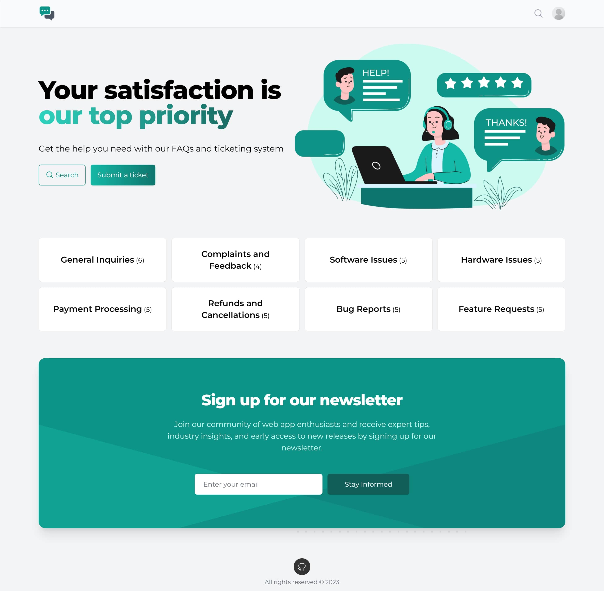

# OTickets - Ticket Support System

OTickets is a ticket support web application that simplifies the management of support tickets and provides a platform
to handle frequently asked questions (FAQs) to enhance visitor and client experience.

If you found this repo helpful, please give it a (⭐). Thank you!

## Table of Contents

- [Demo](#demo)
- [Features](#features)
- [Languages and Tools](#languages-and-tools)
  - [Frontend](#frontend)
  - [Backend](#backend)
  - [Database](#database)
  - [Tools](#tools)
- [Installation](#installation)
  - [Requirements](#requirements)
  - [Installation Steps](#installation-steps)
- [Usage](#usage)
  - [Default Credentials](#default-credentials)
  - [Tests](#tests)
  - [Notifications](#notifications)
  - [Postman Collection](#postman-collection)
- [User Stories](#user-stories)
  - [Visitor](#visitor)
  - [Admin](#admin)
    - [Dashboard](#dashboard)
    - [User Management](#user-management)
    - [Department Management](#department-management)
    - [Client Management](#client-management)
    - [Category Management](#category-management)
    - [FAQ Management](#faq-management)
    - [Canned Response Management](#canned-response-management)
    - [Newsletter Management](#newsletter-management)
    - [Ticket Management](#ticket-management)
    - [Profile Management](#profile-management)
    - [Notification Management](#notification-management)
  - [Agent](#agent)
    - [Dashboard](#dashboard-1)
    - [Canned Response Management](#canned-response-management-1)
    - [Ticket Management](#ticket-management-1)
    - [Profile Management](#profile-management-1)
    - [Notification Management](#notification-management-1)
  - [Client](#client)
    - [Ticket Management](#ticket-management-2)
    - [Profile Management](#profile-management-2)
    - [Notification Management](#notification-management-2)
- [Author](#author)
- [Contributing](#contributing)
- [License](#license)

## Demo

Demo Video: [https://youtu.be/fZGz6KKq8uw](https://youtu.be/fZGz6KKq8uw)

Online Demo: [https://omaghd.com/projects/otickets](https://omaghd.com/projects/otickets)



<a href="#table-of-contents" title="Go back to the table of contents">
⬆️
</a>

## Features

- Implements a responsive design to ensure a good user experience on all devices.
- Utilizes the Repository Pattern and Services for maintainability.
- Follows clean code and Separation of Concerns principles.
- Uses reusable components and layouts to avoid duplication of code.
- Implements input validation and data encryption to protect user data.
- Sanitizes user input to prevent XSS attacks.
- Optimizes database performance by avoiding the N+1 problem.
- Uses Laravel Queues to send notifications asynchronously via email and database.
- And more...

<a href="#table-of-contents" title="Go back to the table of contents">
⬆️
</a>

## Languages and Tools

### Frontend

- TypeScript 5
- Vue.js 3 (Composition API)
- Vue Router 4
- Pinia 2 (State Management)
- Tailwind CSS 3
- Headless UI

### Backend

- PHP 8
- Laravel 10 API
- Laravel Sanctum (Authentication)

### Database

- MySQL

### Tools

- Git
- GitHub
- NPM
- Composer

<a href="#table-of-contents" title="Go back to the table of contents">
⬆️
</a>

## Installation

### Requirements

- PHP 8
- Composer
- Node.js
- NPM

### Installation Steps

1. Clone the repository

   ```bash
   git clone https://github.com/omaghd/otickets.git
   ```

2. Install the dependencies

   ```bash
   cd path/to/backend && composer install
   ```

   ```bash
   cd path/to/frontend && npm install
   ```

3. Create a copy of your .env file

   ```bash
   cd path/to/backend && cp .env.example .env
   ```

4. In the .env file in the backend, add database information to allow Laravel to connect to the database

   ```env
   DB_CONNECTION=mysql
   DB_HOST=
   DB_PORT=
   DB_DATABASE=
   DB_USERNAME=
   DB_PASSWORD=
   ```

5. Generate an app encryption key

   ```bash
   cd path/to/backend && php artisan key:generate
   ```

6. Migrate and seed the database

   ```bash
   cd path/to/backend && php artisan migrate --seed
   ```

7. Launch the backend

   ```bash
   cd path/to/backend && php artisan serve
   ```

8. Change the .env file in the frontend to point to the backend

   ```env
   VITE_API_URL='http://127.0.0.1:8000/'
   VITE_API_URL_API='http://127.0.0.1:8000/api/'
   ```

9. Launch the backend and frontend in separate terminals

   ```bash
   cd path/to/frontend && npm run dev
   ```

   ```bash
   cd path/to/backend && php artisan serve
   ```

10. Visit the application

    ```bash
    http://localhost:8000
    ```

11. Link the storage folder in the backend

    ```bash
    cd path/to/backend && php artisan storage:link
    ```

<a href="#table-of-contents" title="Go back to the table of contents">
⬆️
</a>

## Usage

### Default Credentials

If you ran the database seeder, you can login with the following credentials:

| Role   | Email              | Password    |
| ------ | ------------------ | ----------- |
| Admin  | contact@omaghd.com | OTickets@00 |
| Agent  | agent@omaghd.com   | OTickets@00 |
| Client | client@omaghd.com  | OTickets@00 |

### Tests

To run the tests in the backend, run the following command:

```bash
cd path/to/backend && php artisan test
```

### Notifications

To listen for queued notifications, run the following command:

```bash
cd path/to/backend && php artisan queue:listen
```

### Postman Collection

I made it simple for you to test the API endpoints by providing a Postman collection.

You can download it from <a href="https://omaghd.com/projects/otickets/postman_collection.json" target="_blank" download>here</a>.

<a href="#table-of-contents" title="Go back to the table of contents">
⬆️
</a>

## User Stories

### Visitor

| User Story                                       | Description                                                                                                       |
| ------------------------------------------------ | ----------------------------------------------------------------------------------------------------------------- |
| View homepage                                    | View an engaging introduction to the website                                                                      |
| View the categories list and select a category   | View a list of categories and select a category to view its related FAQs                                          |
| View FAQs within selected category               | View the FAQs within a selected category and read the answers to the questions                                    |
| View related FAQs in same category               | View the related FAQs in the same category                                                                        |
| Search website for questions                     | Search the website for questions using the search palette                                                         |
| Trigger search palette using shortcut            | Trigger the search palette using the <kbd>CTRL + K</kbd> or <kbd>Meta + K</kbd> shortcut                          |
| View search results for matching questions       | View the search results for matching questions in the search palette The search results will include related FAQs |
| Login to my account                              | Access my account by providing my login credentials                                                               |
| Create an account to become a client             | Register and create a new account with my personal details                                                        |
| Request to reset my password using my email      | Request to reset my account password by providing my email address                                                |
| Get notified by email with a reset password link | Receive an email notification containing a link to reset my password                                              |
| Create a new password for my account             | Set a new password for my account using the reset password link from my email                                     |

<a href="#table-of-contents" title="Go back to the table of contents">
⬆️
</a>

### Admin

#### Dashboard

| User Story                                   | Description                                                                |
| -------------------------------------------- | -------------------------------------------------------------------------- |
| View total number of tickets                 | Get an overview of the total number of tickets                             |
| View total number of assigned tickets        | See how many tickets have been assigned to agents                          |
| View total number of unassigned tickets      | See how many tickets are still waiting for assignment                      |
| View total number of resolved tickets        | See how many tickets have been resolved                                    |
| View total number of closed tickets          | See how many tickets have been closed                                      |
| View line chart of created tickets over time | Visualize the number of tickets created over time                          |
| View doughnut chart of ticket categories     | See the distribution of ticket categories in a pie chart                   |
| View agent response times in a stacked chart | See how long agents take to respond to tickets                             |
| View pie chart of ticket counts by status    | See the distribution of tickets by status (assigned, unassigned, resolved) |

<a href="#table-of-contents" title="Go back to the table of contents">
⬆️
</a>

#### User Management

| User Story                          | Description                                                                      |
| ----------------------------------- | -------------------------------------------------------------------------------- |
| View the users list                 | View the paginated list of the user accounts                                     |
| Manage users (create, edit, delete) | Create, edit, or delete user accounts                                            |
| Force delete and restore users      | Permanently delete or restore deleted user accounts                              |
| Filter users list                   | Filter the users list by query, trash, role, department, and creation date range |

<a href="#table-of-contents" title="Go back to the table of contents">
⬆️
</a>

#### Department Management

| User Story                                | Description                                       |
| ----------------------------------------- | ------------------------------------------------- |
| View the departments list                 | View the paginated list of the departments        |
| Manage departments (create, edit, delete) | Create, edit, or delete departments               |
| Force delete and restore departments      | Permanently delete or restore deleted departments |
| Filter departments list                   | Filter the departments list by query and trash    |

<a href="#table-of-contents" title="Go back to the table of contents">
⬆️
</a>

#### Client Management

| User Story                            | Description                                                      |
| ------------------------------------- | ---------------------------------------------------------------- |
| View the clients list                 | View the paginated list of the client accounts                   |
| Manage clients (create, edit, delete) | Create, edit, or delete client accounts                          |
| Force delete and restore clients      | Permanently delete or restore deleted client accounts            |
| Filter clients list                   | Filter the clients list by query, trash, and creation date range |

<a href="#table-of-contents" title="Go back to the table of contents">
⬆️
</a>

#### Category Management

| User Story                               | Description                                                                     |
| ---------------------------------------- | ------------------------------------------------------------------------------- |
| View the categories list                 | View the paginated list of the categories                                       |
| Manage categories (create, edit, delete) | Create, edit, or delete categories                                              |
| Force delete and restore categories      | Permanently delete or restore deleted categories                                |
| Filter categories list                   | Filter the categories list by query, trash, department, and creation date range |

<a href="#table-of-contents" title="Go back to the table of contents">
⬆️
</a>

#### FAQ Management

| User Story                         | Description                                                             |
| ---------------------------------- | ----------------------------------------------------------------------- |
| View the FAQs list                 | View the paginated list of the FAQs                                     |
| Manage FAQs (create, edit, delete) | Create, edit, or delete frequently asked questions                      |
| Force delete and restore FAQs      | Permanently delete or restore deleted FAQs                              |
| Filter FAQs list                   | Filter the FAQs list by query, trash, category, and creation date range |

<a href="#table-of-contents" title="Go back to the table of contents">
⬆️
</a>

#### Canned Response Management

| User Story                                      | Description                                                 |
| ----------------------------------------------- | ----------------------------------------------------------- |
| View the canned responses list                  | View the paginated list of the canned responses             |
| Manage canned responses (create, edit, delete)  | Create, edit, or delete canned responses                    |
| Force delete and restore canned responses       | Permanently delete or restore deleted canned responses      |
| Filter canned responses list by query and trash | Find specific canned responses in the list based on filters |

<a href="#table-of-contents" title="Go back to the table of contents">
⬆️
</a>

#### Newsletter Management

| User Story                                | Description                                            |
| ----------------------------------------- | ------------------------------------------------------ |
| View the newsletters list                 | View the paginated list of the newsletters             |
| Manage newsletters (create, edit, delete) | Create, edit, or delete newsletters                    |
| Filter newsletters list by query          | Find specific newsletters in the list based on filters |

<a href="#table-of-contents" title="Go back to the table of contents">
⬆️
</a>

#### Ticket Management

| User Story                            | Description                                                                                                  |
| ------------------------------------- | ------------------------------------------------------------------------------------------------------------ |
| View the tickets list                 | View the paginated list of all tickets                                                                       |
| Manage tickets (create, edit, delete) | Create, edit, or delete support tickets                                                                      |
| Force delete and restore tickets      | Permanently delete or restore deleted tickets                                                                |
| Assign agents and view ticket history | Assign agents to tickets and view the history of assigned agents and the user who transferred the agent      |
| Filter the tickets list               | Filter the assigned tickets list by query, status, priority, category, client, agent and creation date range |

<a href="#table-of-contents" title="Go back to the table of contents">
⬆️
</a>

#### Profile Management

| User Story                                               | Description                                                                  |
| -------------------------------------------------------- | ---------------------------------------------------------------------------- |
| Update profile information                               | Update profile name, email, phone number, and profile picture                |
| Update password                                          | Update the password                                                          |
| Receive notifications when requesting to change password | Get notified via email and notifications when requesting to change password  |
| Receive notifications when changing password             | Get notified via email and notifications when changing password successfully |

<a href="#table-of-contents" title="Go back to the table of contents">
⬆️
</a>

#### Notification Management

| User Story                                        | Description                                                        |
| ------------------------------------------------- | ------------------------------------------------------------------ |
| Manage notifications (mark as read, delete, etc)  | Mark notifications as read, delete them, and perform other actions |
| View paginated list of notifications              | See all the notifications in a paginated list                      |
| Filter notifications list by all or unread status | Find specific notifications in the list based on status filters    |

<a href="#table-of-contents" title="Go back to the table of contents">
⬆️
</a>

### Agent

#### Dashboard<a id="dashboard-1"></a>

| User Story                                                                     | Description                                                                                                              |
| ------------------------------------------------------------------------------ | ------------------------------------------------------------------------------------------------------------------------ |
| View total number of tickets assigned to me                                    | See how many tickets are assigned to me as an agent                                                                      |
| View total number of assigned tickets                                          | See how many tickets are assigned to all agents                                                                          |
| View total number of unassigned tickets                                        | See how many tickets are unassigned and belong to my department or not assigned to any agent                             |
| View total number of resolved tickets                                          | See how many tickets I have resolved as an agent                                                                         |
| View total number of closed tickets                                            | See how many tickets I have closed as an agent                                                                           |
| View line chart of created tickets over time for tickets assigned to me        | Visualize the number of tickets I have created over time                                                                 |
| View doughnut chart of ticket categories and counts for tickets assigned to me | See the distribution of ticket categories and their count for the tickets assigned to me in a doughnut chart             |
| View pie chart of ticket counts by status for tickets assigned to me           | See the distribution of tickets by status (assigned, unassigned, resolved) for the tickets assigned to me in a pie chart |

<a href="#table-of-contents" title="Go back to the table of contents">
⬆️
</a>

#### Canned Response Management<a id="canned-response-management-1"></a>

| User Story                                | Description                                                                                             |
| ----------------------------------------- | ------------------------------------------------------------------------------------------------------- |
| View the canned responses list            | View the paginated list of the canned responses that belong to me or the canned responses with no agent |
| Manage my canned responses                | Create, edit, or delete my canned responses                                                             |
| Force delete and restore canned responses | Permanently delete or restore deleted my canned responses                                               |
| Filter the canned responses list          | Filter the canned responses list by query and trash                                                     |

<a href="#table-of-contents" title="Go back to the table of contents">
⬆️
</a>

#### Ticket Management<a id="ticket-management-1"></a>

| User Story                                            | Description                                                                                                                                                |
| ----------------------------------------------------- | ---------------------------------------------------------------------------------------------------------------------------------------------------------- |
| View the tickets list                                 | View the paginated list of tickets that I'm assigned to or the tickets that are unassigned and belong to the same department as mine                       |
| Create and assign tickets                             | Create a ticket for a client and assign a random agent or assign it to myself by selecting the category                                                    |
| Edit ticket category and priority                     | Edit the category and priority of a ticket that I'm currently assigned to                                                                                  |
| Assign agents to tickets                              | Assign agents to be the current agent in a ticket that I'm currently assigned to View the history of all assigned agents and see who transferred the agent |
| View ticket details                                   | View the details of the tickets where I'm currently assigned as the agent                                                                                  |
| View ticket conversations                             | View all the conversation of the tickets between me as the current agent or all the previous assigned agents and the client                                |
| Use my canned responses in tickets                    | List my canned responses in the new reply form and copy them to use                                                                                        |
| Reply to tickets                                      | Reply to the tickets where I'm currently assigned as the agent and include file attachments                                                                |
| Resolve and close tickets                             | Reply and mark tickets as resolved or closed where I'm currently assigned as the agent                                                                     |
| Filter assigned tickets list                          | Filter the assigned tickets list by query, status, priority, category, and creation date range                                                             |
| Get notified when assigned to new ticket              | Receive email and notification when I am assigned to a new ticket                                                                                          |
| Get notified when client replies to my ticket         | Receive email and notification when the client replies to a ticket where I am the current agent                                                            |
| Get notified when ticket status is closed or resolved | Receive email and notification when the ticket status is changed to closed or resolved by the client or myself                                             |

<a href="#table-of-contents" title="Go back to the table of contents">
⬆️
</a>

#### Profile Management<a id="profile-management-1"></a>

| User Story                                               | Description                                                                  |
| -------------------------------------------------------- | ---------------------------------------------------------------------------- |
| Update profile information                               | Update profile name, email, phone number, and profile picture                |
| Update password                                          | Update the password                                                          |
| Receive notifications when requesting to change password | Get notified via email and notifications when requesting to change password  |
| Receive notifications when changing password             | Get notified via email and notifications when changing password successfully |

<a href="#table-of-contents" title="Go back to the table of contents">
⬆️
</a>

#### Notification Management<a id="notification-management-1"></a>

| User Story                                        | Description                                                        |
| ------------------------------------------------- | ------------------------------------------------------------------ |
| View the notifications list                       | View the paginated list of the notifications in a paginated list   |
| Manage notifications (mark as read, delete, etc)  | Mark notifications as read, delete them, and perform other actions |
| Filter notifications list by all or unread status | Find specific notifications in the list based on status filters    |

<a href="#table-of-contents" title="Go back to the table of contents">
⬆️
</a>

### Client

#### Ticket Management<a id="ticket-management-2"></a>

| User Story                                            | Description                                                                                                   |
| ----------------------------------------------------- | ------------------------------------------------------------------------------------------------------------- |
| View the tickets list                                 | View the paginated list of my tickets                                                                         |
| Create a ticket                                       | Create a ticket and select its category and priority                                                          |
| View ticket details                                   | View the details of my tickets including ticket reference, category, priority, last reply date, and status    |
| View ticket conversations                             | View all the conversation of the tickets between me and the agents                                            |
| Reply to tickets                                      | Reply to my tickets that are not closed or resolved and include file attachments                              |
| Resolve and close tickets                             | Reply and mark my tickets as resolved or closed                                                               |
| Filter assigned tickets list                          | Filter my tickets list by query, status, priority, category, and creation date range                          |
| Get notified when a new ticket is created for me      | Receive email and notification when a new ticket is created for me                                            |
| Get notified when agent replies to my ticket          | Receive email and notification when the agent replies to my ticket                                            |
| Get notified when ticket status is closed or resolved | Receive email and notification when the ticket status is changed to closed or resolved by the agent or myself |

<a href="#table-of-contents" title="Go back to the table of contents">
⬆️
</a>

#### Profile Management<a id="profile-management-2"></a>

| User Story                                               | Description                                                                  |
| -------------------------------------------------------- | ---------------------------------------------------------------------------- |
| Update profile information                               | Update profile name, email, phone number, and profile picture                |
| Update password                                          | Update the password                                                          |
| Receive notifications when requesting to change password | Get notified via email and notifications when requesting to change password  |
| Receive notifications when changing password             | Get notified via email and notifications when changing password successfully |

<a href="#table-of-contents" title="Go back to the table of contents">
⬆️
</a>

#### Notification Management<a id="notification-management-2"></a>

| User Story                                        | Description                                                        |
| ------------------------------------------------- | ------------------------------------------------------------------ |
| View the notifications list                       | View the paginated list of the notifications in a paginated list   |
| Manage notifications (mark as read, delete, etc)  | Mark notifications as read, delete them, and perform other actions |
| Filter notifications list by all or unread status | Find specific notifications in the list based on status filters    |

<a href="#table-of-contents" title="Go back to the table of contents">
⬆️
</a>

## Author

| Website  | [omaghd.com](https://omaghd.com)             |
| -------- | -------------------------------------------- |
| LinkedIn | [/in/omaghd](https://linkedin.com/in/omaghd) |
| Twitter  | [/omaghd](https://twitter.com/OmaghD)        |
| GitHub   | [/omaghd](https://github.com/omaghd)         |

<a href="#table-of-contents" title="Go back to the table of contents">
⬆️
</a>

## Contributing

Contributions, issues and feature suggestions are welcome!

## License

This project is [MIT licensed](https://choosealicense.com/licenses/mit/).

Please give credit to this project if you plan to use it elsewhere ❤️.

Your support is greatly appreciated!
